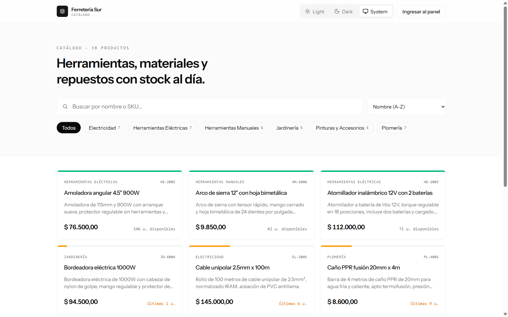
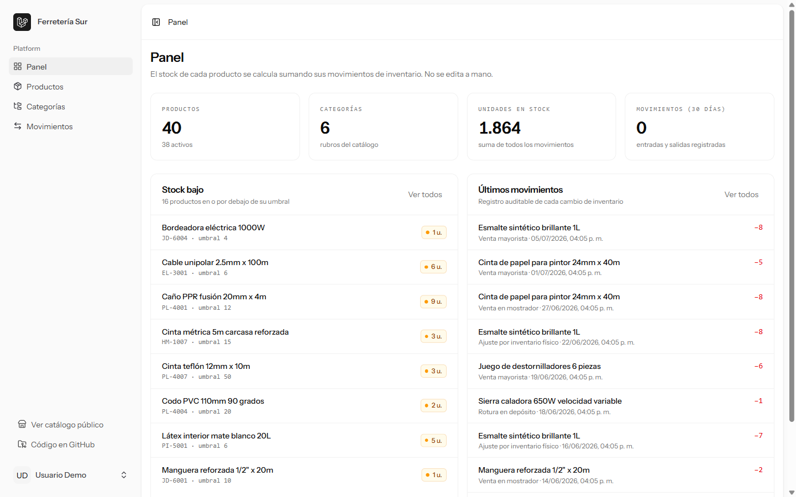
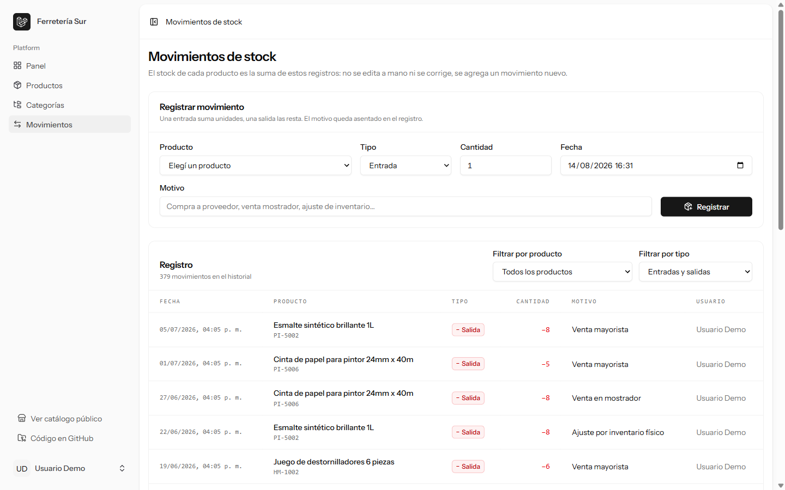
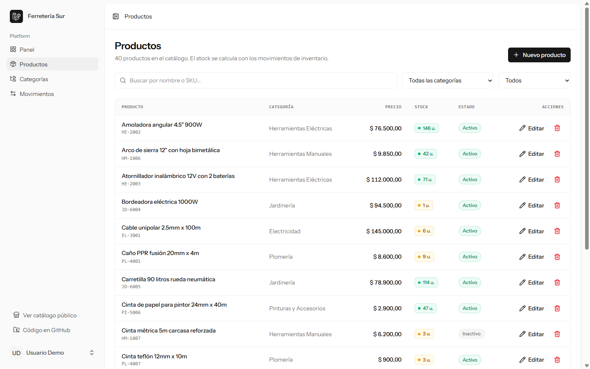
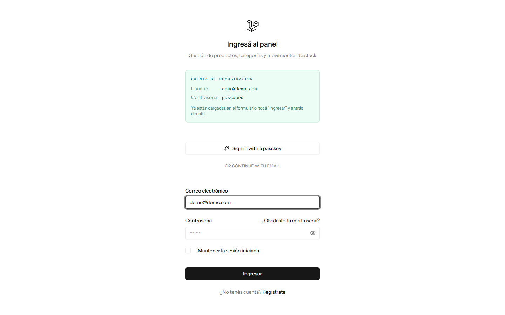

# Catálogo de productos con gestión de inventario

Catálogo público de una ferretería, con un panel privado para administrar productos,
categorías y movimientos de stock.

La decisión de diseño central es que **el stock no se guarda en el producto**: se deriva
sumando los movimientos de inventario. Cada cambio de stock queda asentado como un
registro auditable con su motivo y su fecha. Más abajo está el porqué.

**Demo:** _(pendiente de deploy)_
**Credenciales:** `demo@demo.com` / `password` — están visibles en la pantalla de login y
el formulario viene precargado, así que se entra al panel de un clic.

---

## Stack

| Capa | Tecnología |
| --- | --- |
| Backend | Laravel 13 (PHP 8.5) |
| Frontend | Vue 3 con `<script setup>` (Composition API) + Inertia 3 |
| Estilos | Tailwind CSS 4 + shadcn-vue |
| Base de datos | MySQL 8.4 |
| Tipado de rutas | Laravel Wayfinder (helpers de ruta tipados en TS) |
| Auth | Laravel Fortify (starter kit oficial de Vue) |

El proyecto parte del **starter kit oficial de Vue** de Laravel, que ya trae
autenticación, Inertia, Tailwind y shadcn-vue configurados.

---

## Capturas

### Catálogo público
Búsqueda por nombre o SKU, filtro por rubro y paginación — todo resuelto en el servidor.



### Panel de gestión
Productos con stock bajo y últimos movimientos de inventario.



### Movimientos de stock
El registro auditable del que sale el stock de cada producto.



### Listado de productos
CRUD completo, con el stock calculado y el estado de cada producto.



### Login
Las credenciales de demo quedan a la vista para que se pueda entrar sin fricción.



---

## Funcionalidad

**Público (sin login)**
- Listado del catálogo con búsqueda por nombre o SKU
- Filtro por categoría y ordenamiento (nombre, precio, más recientes)
- Paginación server-side
- Detalle de producto con stock disponible y productos relacionados

**Panel (con login)**
- ABM de productos y de categorías
- Registro de movimientos de stock (entrada / salida con motivo y fecha)
- Dashboard con productos en stock bajo y últimos movimientos
- Filtros del registro de movimientos por producto y por tipo

---

## La decisión de diseño: por qué el stock se deriva de los movimientos

Lo intuitivo sería poner una columna `stock` en `products` y actualizarla con cada venta o
compra. Este proyecto no hace eso, a propósito.

### El problema de guardar el stock en el producto

Un campo `stock` editable responde *cuánto hay*, pero no responde nada de lo que en la
práctica se necesita saber:

- ¿Por qué bajó de 40 a 12?
- ¿Fue una venta, una rotura, un ajuste de inventario, un error de carga?
- ¿Quién lo tocó y cuándo?

Peor todavía: si alguien se equivoca y escribe 400 en lugar de 40, **la información
anterior se perdió**. No hay forma de reconstruirla, porque el número era el único dato que
existía.

### Cómo está resuelto acá

La tabla `stock_movements` guarda un registro por cada cambio de inventario:

| Campo | Para qué |
| --- | --- |
| `product_id` | a qué producto afecta |
| `type` | `entrada` (suma) o `salida` (resta) |
| `quantity` | cuántas unidades |
| `reason` | el motivo, obligatorio |
| `occurred_at` | cuándo pasó |
| `user_id` | quién lo registró |

El stock actual es una consecuencia de esos registros:

```
stock = Σ(entradas) − Σ(salidas)
```

Esto trae tres cosas que el campo editable no da:

1. **Historial completo.** Se puede reconstruir el stock a cualquier fecha pasada.
2. **Trazabilidad.** Cada unidad que entró o salió tiene motivo, fecha y responsable.
3. **Corrección sin destrucción.** Un error no se "arregla" pisando el número: se registra
   un movimiento de ajuste. El error queda documentado, que es justamente lo que se quiere
   en un inventario.

Es el mismo criterio que usa la contabilidad de doble entrada: no se edita el saldo, se
asienta el movimiento.

### Cómo se implementa sin pagar N+1

El riesgo obvio de derivar un valor es tener que consultarlo producto por producto. Se
evita con una **subconsulta correlacionada** que viaja junto al listado:

```php
// app/Models/Product.php
public function scopeWithCurrentStock(Builder $query): Builder
{
    return $query->addSelect([
        'current_stock' => StockMovement::query()
            ->selectRaw(
                'COALESCE(SUM(CASE WHEN type = ? THEN quantity ELSE -quantity END), 0)',
                [StockMovementType::Entrada->value],
            )
            ->whereColumn('stock_movements.product_id', 'products.id'),
    ]);
}
```

Listar 12 productos con su stock cuesta **una sola consulta**, no 13. El listado público
completo (productos + stock + categorías + conteos) se resuelve en 6 queries.

Para los productos en stock bajo se usa `HAVING`, porque `current_stock` es un alias del
`SELECT` y no está disponible en el `WHERE`:

```php
public function scopeLowStock(Builder $query): Builder
{
    return $query->withCurrentStock()
        ->havingRaw('current_stock <= low_stock_threshold');
}
```

### La regla se sostiene en toda la app

- `products` **no tiene** columna `stock`.
- El formulario de producto **no tiene** campo de stock. Lo único configurable es
  `low_stock_threshold`, que es el umbral de alerta, no la existencia.
- `StoreProductRequest` no valida ningún campo `stock`, así que tampoco entra por
  asignación masiva.
- La única forma de mover stock es `StockMovementController@store`.
- `StoreStockMovementRequest` rechaza una salida mayor al stock disponible, para que el
  saldo derivado nunca quede negativo.

---

## Otras decisiones

**Validación en Form Requests, no en el controlador.** Cada operación tiene su Form Request
(`StoreProductRequest`, `UpdateProductRequest`, `StoreCategoryRequest`,
`UpdateCategoryRequest`, `StoreStockMovementRequest`). Los slugs se derivan del nombre en
`prepareForValidation()`, así que no son un campo que el usuario tenga que completar.

**Filtrado en el servidor.** La búsqueda, el filtro por categoría, el orden y la paginación
se resuelven en SQL. El cliente nunca recibe el catálogo completo, sólo la página que está
mirando. Los filtros viajan en la URL, así que cualquier vista del catálogo se puede
compartir con un link.

**Eager loading.** Los listados cargan `category` con `with()` y el stock con la
subconsulta, para no disparar una query por fila.

**Enum de PHP para el tipo de movimiento.** `StockMovementType` centraliza el signo de cada
tipo (`Entrada` suma, `Salida` resta), y se castea directo en el modelo.

**Borrado de categorías con productos.** Está bloqueado a nivel base de datos
(`restrictOnDelete`) y también en el controlador, con un mensaje que explica qué hacer.
Los movimientos, en cambio, se borran en cascada con el producto: sólo existen para
explicar el stock de ese producto.

---

## Cómo levantarlo local

### Requisitos
- PHP 8.3 o superior, con las extensiones `pdo_mysql`, `mbstring`, `openssl`, `fileinfo`,
  `curl`, `zip`, `gd`, `intl`
- Composer 2
- Node.js 20 o superior
- Docker (para MySQL, no hace falta instalarlo en el sistema)

### Pasos

```bash
git clone https://github.com/FrancoLeoneDev/laravel-vue-catalogo.git
cd laravel-vue-catalogo

# Dependencias
composer install
npm install

# Configuración
cp .env.example .env
php artisan key:generate

# Base de datos: levanta MySQL 8.4 en el puerto 3307
docker compose up -d

# Esperá unos segundos a que el contenedor quede healthy y después:
php artisan migrate --seed

# Servidor de desarrollo (Laravel + Vite juntos)
composer dev
```

La app queda en `http://localhost:8000`.

El seeder carga 6 categorías, 40 productos y ~370 movimientos de stock distribuidos en los
últimos 6 meses, así que el catálogo y el panel arrancan con datos reales, no vacíos.

### Datos de acceso

| Usuario | Contraseña |
| --- | --- |
| `demo@demo.com` | `password` |

### Comandos útiles

```bash
php artisan migrate:fresh --seed   # resetea la base con datos nuevos
composer lint                      # Laravel Pint
composer types:check               # PHPStan (larastan)
npm run types:check                # vue-tsc
docker compose down -v             # borra el contenedor y su volumen
```

### Configuración de MySQL

`docker-compose.yml` levanta MySQL 8.4 en el puerto **3307** (no el 3306) para no chocar
con una instalación local de MySQL o XAMPP. Los valores por defecto salen de `.env`:

```env
DB_CONNECTION=mysql
DB_HOST=127.0.0.1
DB_PORT=3307
DB_DATABASE=catalogo
DB_USERNAME=catalogo
DB_PASSWORD=secret
```

---

## Estructura

```
app/
├── Enums/StockMovementType.php          # entrada / salida y su signo
├── Http/
│   ├── Controllers/
│   │   ├── CatalogController.php        # catálogo público
│   │   └── Admin/
│   │       ├── DashboardController.php
│   │       ├── ProductController.php
│   │       ├── CategoryController.php
│   │       └── StockMovementController.php
│   └── Requests/                        # toda la validación vive acá
└── Models/
    ├── Product.php                      # scopeWithCurrentStock / scopeLowStock
    ├── Category.php
    └── StockMovement.php

resources/js/
├── layouts/PublicLayout.vue             # cabecera del catálogo público
├── pages/
│   ├── catalog/                         # Index, Show
│   └── admin/                           # Dashboard, products, categories, movements
├── components/                          # ProductCard, StockBadge, Pagination
└── types/catalog.ts                     # tipos del dominio

database/
├── migrations/
├── factories/
└── seeders/CatalogSeeder.php            # catálogo + historial de movimientos
```
